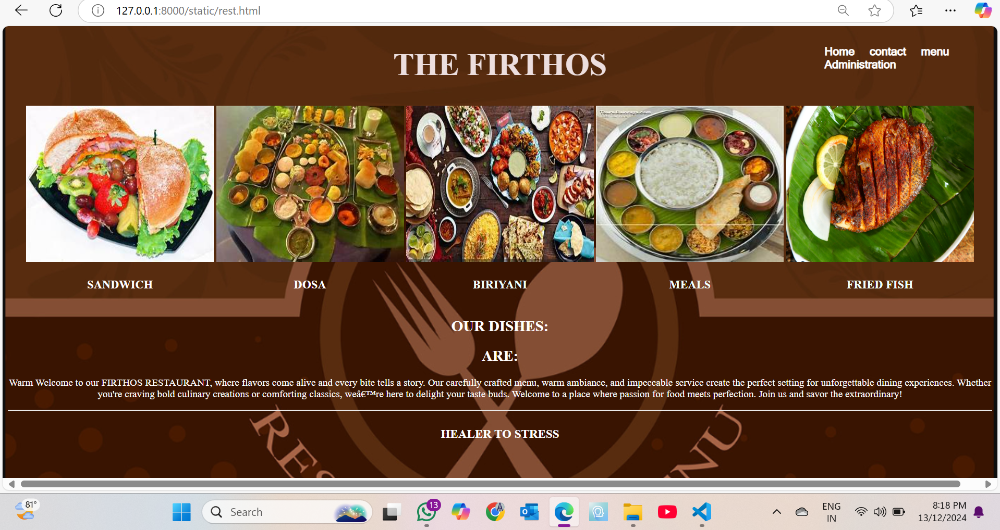
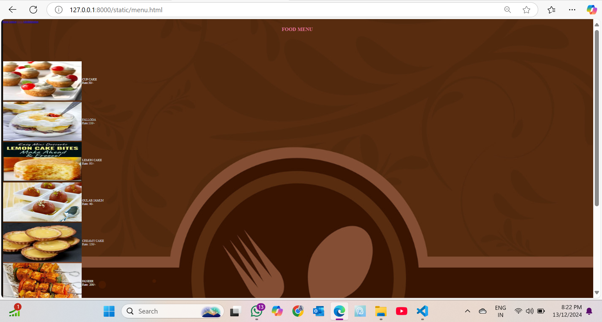
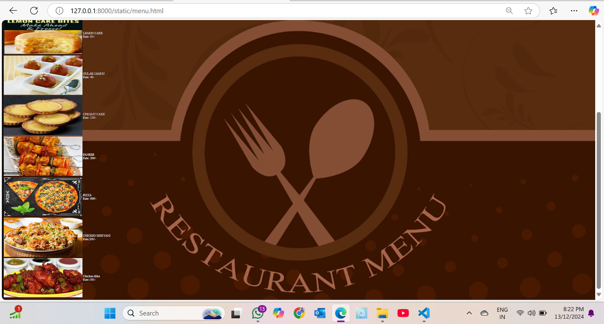
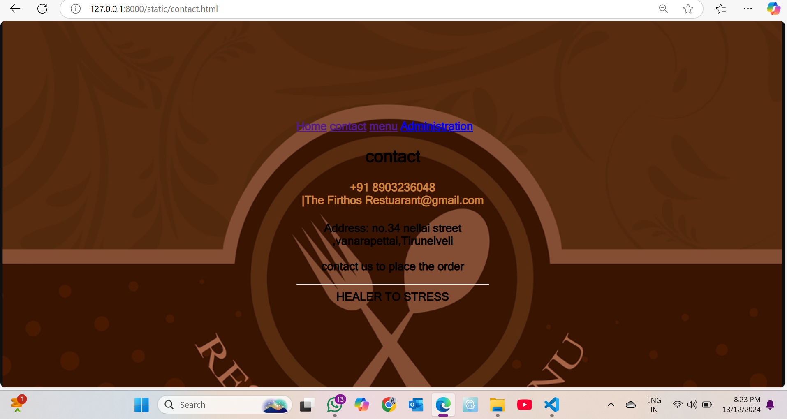
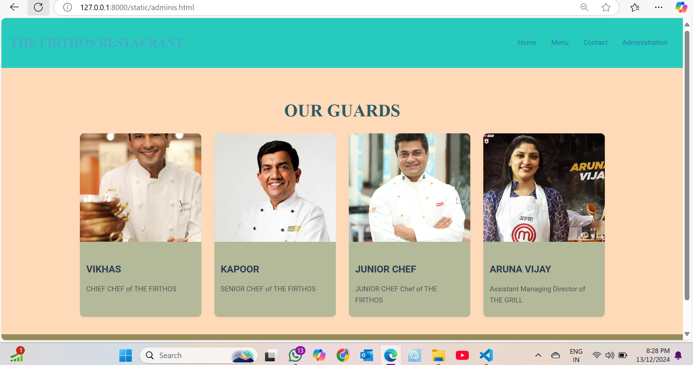

# Ex.07 Restaurant Website
## Date:13.12.2024

## AIM:
To develop a static Restaurant website to display the food items and services provided by them.

## DESIGN STEPS:

### Step 1:
Requirement collection.

### Step 2:
Creating the layout using HTML and CSS.

### Step 3:
Updating the sample content.

### Step 4:
Choose the appropriate style and color scheme.

### Step 5:
Validate the layout in various browsers.

### Step 6:
Validate the HTML code.

### Step 7:
Publish the website in the given URL.

## PROGRAM:
```
rest.html
<!DOCTYPE html>
<html lang="en"?>
    <head>
        <title>THE FIRTHOS RESTAURANT</title>
        
    </head>
    <style>
        body{
            background-image: url("restau.png");
            background-size: cover;
            background-position: center;
        }
        .nav-list{
            position: absolute;
            top: 30px;
            left: 80%;
            transform:  translatex(10%);
        }
        .nav-list a{
            display: inline blocks;
            margin: 0 10px;
            font-family:MS Sans Serif;
            text-decoration: none;
            font-size: 18px;
            font-weight: bold;
            color: white;
        }
        .nav-list a:hover{
            color: rgb(235, 9, 149);
        }
    </style>
        <div class="nav-list">
        
        <a href="rest.html">Home</a>
        <a href="contact.html">contact</a>
        <a href="menu.html">menu</a>
        <a href="administration.html">Administration</a>

        </div>
    <body style="color: white;">
        
        <center>
            <h1 style="color:rgb(236, 222, 222); font-size: 50px;">THE FIRTHOS</h1>
    <table> 
        <center>
        <tr>
            <td></td>
            <td></td>
            <td></td>
            <td></td>
            <td></td>
        </tr>
        </center>
        <tr>
            <td><h3 style="color:white;"><center>SANDWICH</center></h3></td>
            <td><h3 style="color:white;"><center>DOSA</center></h3></td>
            <td><h3 style="color:azure;"><center>BIRIYANI</center></h3></td>
            <td><h3 style="color:azure;"><center>MEALS</center></h3></td>
            <td><h3 style="color:azure;"><center>FRIED FISH</center></h3></td>
        </tr>
    </table>
    <h2>OUR DISHES:
        <h2><center>ARE:</center></h2>
    </h2>
        <p style="font-family: 'Times New Roman',Times, serif";><center>Warm Welcome to our FIRTHOS RESTAURANT, where flavors come alive and every bite tells a story. Our carefully crafted menu, warm ambiance, and impeccable service create the perfect setting for unforgettable dining experiences. Whether you're craving bold culinary creations or comforting classics, we’re here to delight your taste buds. Welcome to a place where passion for food meets perfection. Join us and savor the extraordinary!

        </p> 
        <hr>
        <tr>
            <td><h4 style="font-size: larger;"><center>HEALER TO STRESS</center></h4></td>
        </tr>
    </body>        
</html>

menu.html
<!DOCTYPE html>
<html>
    <head>
        <title>Menu</title>
    </head>
    <body>
        <style>
             body{
            background-image: url("restau.png");
            background-size: cover;
        }
        </style>
        <div class="nav-list">
        
            <a href="rest.html">Home</a>
            <a href="contact.html">contact</a>
            <a href="menu.html">menu</a>
            <a href="adminis.html">Administration</a>
    
            </div>
        <center>
        <h1 style="color: rgb(25, 188, 28);">FOOD MENU</h1>
    </center>
    <table>
        <tr>
        <th></th><td style="color: rgb(194, 203, 215); font-size: larger;">CUP CAKE<br>Rate:30/-</td><br></tr>
        <tr>
        <th></th><td style="color: rgb(191, 204, 214); font-size: larger;">FALLODA<br>Rate:110/-</td></tr><br>
        <tr>
        <th></th><td style="color: rgb(211, 219, 225); font-size: larger;">LEMON CAKE<br>Rate: 95/-</td><br>></tr>
        <tr>
        <th></th><td style="color: rgb(215, 221, 225); font-size: larger;">GULAB JAMUN<br>Rate: 40-</td><br></tr>
        <tr>
        <th></th><td style="color: rgb(201, 207, 213); font-size: larger;">CREAMY CAKE<br>Rate: 150/-</td><br></tr>
        <tr>
        <th></th><td style="color: rgb(227, 233, 238); font-size: larger;">PANNER<br>Rate: 200/-</td><br></tr>
        <tr>
        <th></th><td style="color: rgb(235, 241, 247); font-size: larger;">PIZZA<br>Rate: 999/-</td><br></tr>
        <tr>
        <th></th><td style="color: rgb(220, 228, 234); font-size: larger;">CHICKEN BIRIYANI<br>Rate: 200/-</td><br></tr>
        <tr>
        <th></th><td style="color: rgb(220, 228, 234); font-size: larger;">Chicken tikka<br>Rate: 190/-</td><br></tr>
            <tr>
        
    </table>


        
    </body>
</html>

contact.html

<html>
    <head>
        <title> CONTACT </title>
    </head>
    <style>
        
        body{
        
            background-image: url("restau.png");
            background-size: cover;
            background-position: center;
        }
        body{
            display: inline blocks;
            margin:0 600px;
            font-family:MS Sans Serif;
            text-decoration: none;
            font-size: 23px;
            font-weight: bolder;
            color: lavender(217, 231, 239);
            position:absolute;
            top: 200px;
        }
    </style>
    <div class="nav-list">
        
        <a href="rest.html">Home</a>
        <a href="contact.html">contact</a>
        <a href="menu.html">menu</a>
        <a href="administration.html">Administration</a>

        </div>
    <center>
        <section id="contact">  
            <h1 style="colory:red">contact<h1>
            <h4  style="color:peru">+91 8903236048 <br> |The Firthos Restuarant@gmail.com</h4>
            <P  style="color:black">Address: no.34 nellai street ,vanarapettai,Tirunelveli <br>
                <br> contact us to place the order<br>
            <hr> HEALER TO STRESS 
            </P>
         </section> 
    </center>
    </body>
</html>

adminis.html

<!DOCTYPE html>
<html lang="en">
<head>
    <meta charset="UTF-8">
    <meta name="viewport" content="width=device-width, initial-scale=1.0">
    <title>THE FIRTHOS  RESTAURANT - Administration</title>

    <style>
        body {
            margin: 0;
            font-family: 'Roboto', sans-serif;
            line-height: 1.6;
            color: darkkhaki;
            background-color: #f63a3a;
            box-sizing: border-box;
        }

        *, *::before, *::after {
            box-sizing: inherit;
        }

        header {
            background: #27cbbe;
            color: rgb(69, 171, 199);
            padding: 15px 20px;
            display: flex;
            align-items: center;
            justify-content: space-between;
            box-shadow: 0 4px 6px rgba(1, 33, 15, 0.1);
        }

        header h1 {
            font-size: 1.8rem;
            font-family: 'Playfair Display', serif;
        }

        header nav a {
            text-decoration: none;
            color: rgb(33, 121, 176);
            font-weight: 500;
            margin: 0 15px;
            transition: color 0.3s ease;
            font-size: 1rem;
        }

        header nav a:hover {
            color: #2a688b;
        }

        .admin-container {
            padding: 40px 20px;
            background: peachpuff;
            text-align: center;
        }

        .admin-container h1 {
            font-size: 2.5rem;
            color: #315b67;
            margin-bottom: 20px;
            font-family: 'Playfair Display', serif;
        }

        .admin-items {
            display: flex;
            flex-wrap: wrap;
            gap: 30px;
            justify-content: center;
        }

        .admin-item {
            background: rgb(180, 185, 153);
            border-radius: 10px;
            box-shadow: 0 4px 6px rgba(159, 154, 149, 0.1);
            width: 280px;
            overflow: hidden;
            transition: transform 0.3s ease;
            text-align: left;
        }

        .admin-item img {
            width: 100%;
            height: 250px;
            object-fit: cover;
        }

        .admin-item:hover {
            transform: scale(1.05);
        }

        .admin-details {
            padding: 15px;
        }

        .admin-details h3 {
            font-size: 1.4rem;
            color: #2c3e50;
            margin-bottom: 8px;
        }

        .admin-details p {
            font-size: 1rem;
            color: #555;
            margin-bottom: 10px;
        }

        footer {
            background: #978b5a;
            color: rgb(123, 154, 169);
            text-align: center;
            padding: 15px 0;
        }

        footer a {
            color: #dba419;
            text-decoration: none;
            font-weight: 500;
            transition: color 0.3s ease;
        }

        footer a:hover {
            color: #ecf0f1;
        }

        @media (max-width: 768px) {
            header h1 {
                font-size: 1.5rem;
            }

            .admin-items {
                flex-direction: column;
                gap: 20px;
            }

            .admin-item {
                width: 100%;
            }

            header nav a {
                font-size: 0.9rem;
                margin: 0 5px;
            }
        }
    </style>
</head>
<body>    

<header>
        <h1>THE FIRTHOS RESTAURANT</h1>
        <nav>
            <a href="rest.html">Home</a>
            <a href="menu.html">Menu</a>
            <a href="contact.html">Contact</a>
            <a href="administration.html">Administration</a>
        </nav>
    </header>

    <div class="admin-container">
        <h1>OUR GUARDS</h1>
        <div class="admin-items">
            <div class="admin-item">
                
                <div class="admin-details">
                    <h3>VIKHAS</h3>
                    <p>CHIEF CHEF of THE FIRTHOS</p>
                </div>
            </div>

            <div class="admin-item">
                
                <div class="admin-details">
                    <h3>KAPOOR</h3>
                    <p>SENIOR CHEF of THE FIRTHOS</p>
                </div>
            </div>

            <div class="admin-item">
                
                <div class="admin-details">
                    <h3>JUNIOR CHEF</h3>
                    <p>JUNIOR CHEF Chef of THE FIRTHOS</p>
                </div>
            </div>

            <div class="admin-item">
                
                <div class="admin-details">
                    <h3>ARUNA VIJAY</h3>
                    <p>Assistant Managing Director of THE GRILL</p>
                </div>
            </div>
        </div>
    </div>

    <footer>
        <p>&copy; 2024 THE RESTAURANT. All rights reserved. | <a href="resT.html">Back to Home</a></p>
    </footer>

</body>
</html>
```


## OUTPUT:





## RESULT:
The program for designing software company website using HTML and CSS is completed successfully.
